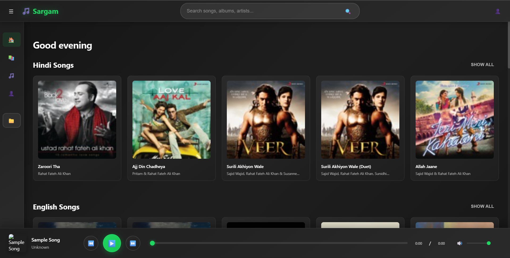
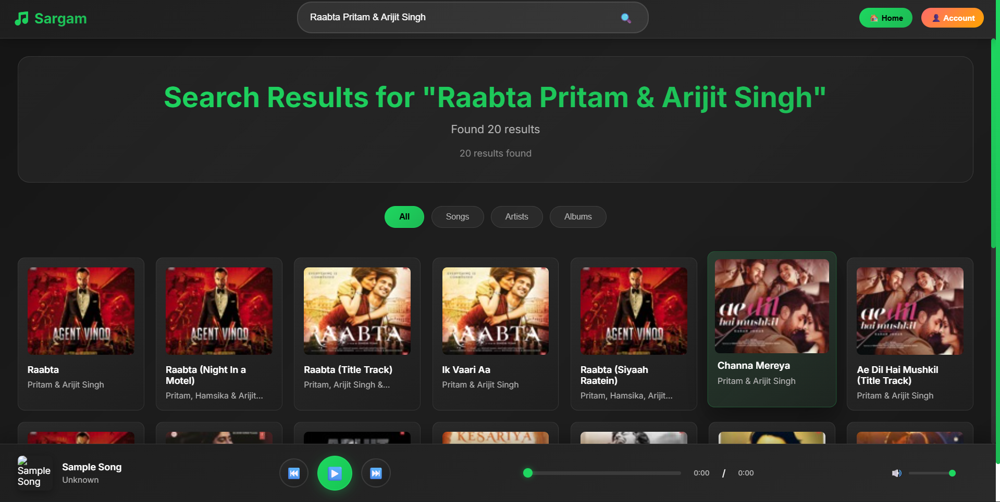
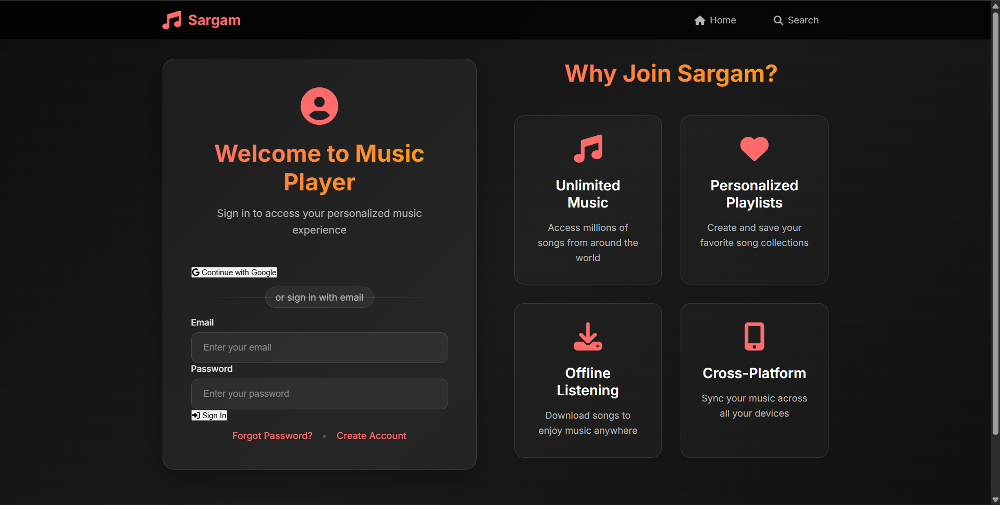

# 🎵 Sargam - Modern Music Player

A beautiful, modern music streaming application built with HTML, CSS, JavaScript, and Python Flask backend. Sargam offers a Spotify-like experience with local music management, search functionality, playlist creation, and user authentication.



---

## 📑 Table of Contents
- [Features](#-features)
- [Screenshots](#-screenshots)
- [Quick Start](#-quick-start)
- [Detailed Setup](#-detailed-setup-instructions)
- [Firebase Configuration](#-firebase-configuration-guide)
- [Backend Setup](#-backend-flask-server-setup)
- [Project Structure](#-project-structure)
- [Technology Stack](#-technology-stack)
- [Usage Guide](#-usage-guide)
- [API Documentation](#-api-documentation)
- [Troubleshooting](#-troubleshooting)
- [Contributing](#-contributing)

---

## ✨ Features

### 🎧 Core Music Features
- **Audio Playback**: High-quality audio streaming with seek controls
- **Search Functionality**: Real-time search for songs, artists, and albums
- **Playlist Management**: Create, edit, and manage custom playlists
- **Queue System**: Add songs to queue and manage playback order
- **Volume Control**: Smooth volume adjustment with visual feedback

### 🎨 User Interface
- **Modern Design**: Spotify-inspired dark theme with green accents
- **Responsive Layout**: Works seamlessly on desktop and mobile devices
- **Smooth Animations**: CSS transitions and hover effects
- **Card-based Layout**: Clean, organized display of songs and albums
- **Search Suggestions**: Real-time search suggestions with keyboard navigation

### 🔐 User Management
- **Account System**: User registration and authentication
- **Personalized Experience**: User-specific playlists and preferences
- **Firebase Integration**: Secure cloud-based user management

### 📱 Additional Features
- **File Upload**: Upload your local music files to the platform
- **Cross-platform**: Sync your music across all devices
- **Offline Support**: Download songs for offline listening
- **Multiple Formats**: Support for MP3, WAV, OGG, M4A, FLAC

## 📸 Screenshots

### Home Page

*Browse through curated Hindi and English song collections*

### Search Results

*Powerful search functionality with categorized results*

### Account & Login

*User authentication with Google sign-in and email options*

## ⚡ Quick Start

### Prerequisites
- **Python 3.7+** - [Download Python](https://www.python.org/downloads/)
- **Modern Web Browser** - Chrome, Firefox, Safari, or Edge
- **Google Account** - For Firebase setup
- **Basic Command Line Knowledge**

### 5-Minute Setup

1. **Clone/Download the project**
   ```bash
   git clone https://github.com/AkshatBajpai4218/Music-player.git
   cd music-player
   ```

2. **Install Python dependencies**
   ```bash
   pip install -r requirements.txt
   ```

3. **Install Node.js dependencies** (optional, only for Firebase)
   ```bash
   npm install
   ```

4. **Set up Firebase (Required for user authentication)**
   
   a. Create a Firebase project:
   - Go to [Firebase Console](https://console.firebase.google.com)
   - Click "Add project" and follow the setup wizard
   - Once created, go to Project Settings (gear icon)
   
   b. Get your Firebase configuration:
   - In Project Settings, scroll to "Your apps"
   - Click the web icon `</>` to add a web app
   - Register your app and copy the configuration object
   
   c. Add configuration to your project:
   - Open `firebaseService.js` and `account.js`
   - Replace the placeholder values with your actual Firebase config:
   ```javascript
   const firebaseConfig = {
       apiKey: "your-actual-api-key",
       authDomain: "your-project-id.firebaseapp.com",
       projectId: "your-project-id",
       storageBucket: "your-project-id.firebasestorage.app",
       messagingSenderId: "your-messaging-sender-id",
       appId: "your-app-id",
       measurementId: "your-measurement-id"
   };
   ```
   
   d. Enable Firebase services:
   - In Firebase Console, go to **Authentication**
   - Click "Get Started"
   - Enable "Email/Password" and "Google" sign-in methods
   - Go to **Firestore Database**
   - Click "Create database"
   - Start in "Test mode" for development
   - Choose a location and click "Enable"

5. **Run the application**
   ```bash
   python app.py
   ```

6. **Open your browser**
   - Navigate to `http://localhost:5000`
   - Start enjoying your music!

---

## 📖 Detailed Setup Instructions

### Step 1: Download and Extract

1. Download this project as ZIP or clone using Git
2. Extract to a folder on your computer (e.g., `D:\Music-Player`)
3. Open the folder in your code editor (VS Code recommended)

### Step 2: Install Python Backend

```bash
# Navigate to project folder
cd path/to/music-player

# Install required Python packages
pip install -r requirements.txt
```

**What gets installed:**
- `Flask` - Web framework for the backend
- `flask-cors` - To handle cross-origin requests
- `Werkzeug` - Secure file upload handling

### Step 3: Configure Firebase (Required for User Authentication)

Firebase is needed for:
- ✅ User registration and login
- ✅ Google Sign-In
- ✅ Saving user playlists
- ✅ Syncing data across devices

**See detailed Firebase setup below** ⬇️

### Step 4: Start the Application

```bash
# Start the Flask backend server
python app.py
```

You should see:
```
 * Running on http://localhost:5000
 * Debug mode: on
```

### Step 5: Access the Application

Open your browser and go to: **http://localhost:5000**

**⚠️ Important:** Always access via `http://localhost:5000`, not by opening HTML files directly!

---

## 🔥 Firebase Configuration Guide

### Why Firebase?
Firebase provides authentication and database services for user accounts and playlist management.

### Complete Setup Steps

#### 1️⃣ Create Firebase Project

1. Go to [Firebase Console](https://console.firebase.google.com)
2. Click **"Add project"**
3. Enter project name: `sargam-music-player` (or any name)
4. Disable Google Analytics (optional)
5. Click **"Create project"**

#### 2️⃣ Register Web App

1. In Firebase dashboard, click **Web icon** (`</>`)
2. Enter app nickname: `Sargam Web`
3. **Don't** check Firebase Hosting
4. Click **"Register app"**
5. **Copy the configuration code shown**

#### 3️⃣ Get Your Configuration

You'll see something like:
```javascript
const firebaseConfig = {
  apiKey: "AIzaSyXXXXXXXXXXXXXXXXXX",
  authDomain: "your-project.firebaseapp.com",
  projectId: "your-project-id",
  storageBucket: "your-project.firebasestorage.app",
  messagingSenderId: "123456789",
  appId: "1:123456789:web:abcdef",
  measurementId: "G-XXXXXXXX"
};
```

**📋 Copy this entire object!**

#### 4️⃣ Add Configuration to Project

You need to update **TWO files** with your Firebase config:

**File 1: `firebaseService.js`** (Line 9-16)
```javascript
// Replace this section with your Firebase config
const firebaseConfig = {
    apiKey: "YOUR_ACTUAL_API_KEY",
    authDomain: "your-project.firebaseapp.com",
    projectId: "your-project-id",
    storageBucket: "your-project.firebasestorage.app",
    messagingSenderId: "your-sender-id",
    appId: "your-app-id",
    measurementId: "your-measurement-id"
};
```

**File 2: `account.js`** (Line 8-15)
- Replace with the **same configuration** as above

#### 5️⃣ Enable Authentication

1. In Firebase Console → **Authentication**
2. Click **"Get started"**
3. Go to **"Sign-in method"** tab
4. Enable **"Email/Password"**:
   - Toggle ON
   - Click Save
5. Enable **"Google"**:
   - Toggle ON
   - Select support email
   - Click Save

#### 6️⃣ Create Firestore Database

1. In Firebase Console → **Firestore Database**
2. Click **"Create database"**
3. Choose **"Start in test mode"**
4. Select location (closest to you)
5. Click **"Enable"**

#### 7️⃣ Set Security Rules

1. In Firestore → **Rules** tab
2. Replace with:
```javascript
rules_version = '2';
service cloud.firestore {
  match /databases/{database}/documents {
    match /users/{userId} {
      allow read, write: if request.auth != null && request.auth.uid == userId;
      match /playlists/{playlistId} {
        allow read, write: if request.auth != null && request.auth.uid == userId;
      }
    }
  }
}
```
3. Click **"Publish"**

#### 8️⃣ Add Authorized Domain

1. Authentication → **Settings** → **Authorized domains**
2. Add: `localhost` (should already be there)
3. For production, add your domain

### ✅ Firebase Setup Complete!

Test by:
1. Starting your app (`python app.py`)
2. Going to Account page
3. Signing up with email or Google
4. Creating a playlist

---

## 🐍 Backend (Flask Server) Setup

### What Does the Backend Do?

- 📤 **File Upload** - Upload MP3, WAV, OGG, M4A, FLAC files
- 💾 **Persistent Storage** - Songs saved in `songs` folder
- 🔄 **Auto-loading** - Previously uploaded songs load automatically
- 🔒 **Security** - Safe filename handling

### Backend Features

#### File Upload System
```python
# Supported formats
ALLOWED_EXTENSIONS = {'mp3', 'wav', 'ogg', 'm4a', 'flac'}

# Max file size: 16MB
MAX_CONTENT_LENGTH = 16 * 1024 * 1024
```

#### API Endpoints

| Method | Endpoint | Description |
|--------|----------|-------------|
| `POST` | `/api/upload` | Upload multiple audio files |
| `GET` | `/api/songs` | List all uploaded songs |
| `DELETE` | `/api/songs/<filename>` | Delete a song |
| `GET` | `/songs/<filename>` | Stream audio file |

### Running the Backend

```bash
# Start server
python app.py

# Server will run on: http://localhost:5000
# Press Ctrl+C to stop
```

### Upload Usage

1. Click **"Upload Local Files"** in sidebar
2. Select audio files (MP3, WAV, OGG, M4A, FLAC)
3. Maximum 16MB per file
4. Files saved to `songs/` folder
5. Available across all sessions

### Backend File Structure
```
songs/
├── playlist_uploads/     # User uploaded songs
└── [default songs]       # Pre-loaded songs
```

---

## 📁 Project Structure

```
music-player/
├── images/                 # Image assets and screenshots
├── songs/                  # Audio files storage
│   └── playlist_uploads/   # User uploaded songs
├── index.html             # Main application page
├── account.html           # User account page  
├── results.html           # Search results page
├── style.css              # Main stylesheet
├── script.js              # Main JavaScript functionality
├── audioPlayerManager.js  # Audio player logic
├── firebaseService.js     # Firebase integration
├── app.py                 # Flask backend server
├── requirements.txt       # Python dependencies
├── package.json           # Node.js dependencies
└── README.md             # This file
```

## 🛠️ Technology Stack

### Frontend
- **HTML5**: Semantic markup and structure
- **CSS3**: Modern styling with CSS Grid, Flexbox, and animations
- **JavaScript ES6+**: Interactive functionality and DOM manipulation
- **Firebase SDK**: Authentication and real-time database

### Backend
- **Python Flask**: Lightweight web framework
- **File Upload Handling**: Secure file management
- **CORS Support**: Cross-origin resource sharing

### Design
- **Responsive Design**: Mobile-first approach
- **CSS Variables**: Consistent theming system
- **Modern UI Components**: Card layouts, modals, and form elements

## 💡 Usage Guide

### For First-Time Users

1. **Start the Server**
   ```bash
   python app.py
   ```

2. **Create an Account**
   - Click **"Account"** button in top-right
   - Sign up with email or Google
   - Your playlists will be saved to Firebase

3. **Upload Your Music**
   - Click **"Upload Local Files"** in sidebar
   - Select your MP3/WAV/OGG files
   - Songs appear in the player immediately

4. **Browse & Play**
   - Browse Hindi/English song sections on home
   - Click any song to play
   - Use player controls at bottom

5. **Search Music**
   - Click search icon or press `/`
   - Type song name, artist, or album
   - Filter by Songs, Artists, or Albums

6. **Create Playlists**
   - Go to Library section
   - Click "Create Playlist"
   - Add songs and save

### Key Features Usage

#### 🎵 Playing Music
- **Play/Pause** - Click play button or spacebar
- **Next/Previous** - Use arrow buttons
- **Seek** - Drag progress bar
- **Volume** - Adjust volume slider
- **Queue** - View upcoming songs

#### 🔍 Search
- **Quick Search** - Type in top search bar
- **Keyboard Navigation** - Use arrow keys in suggestions
- **Category Filter** - Filter by All/Songs/Artists/Albums
- **Results Page** - Click search icon for full results

#### 📚 Playlists
- **Create** - Library → Create Playlist
- **Add Songs** - Right-click song → Add to Playlist
- **Edit** - Click playlist → Edit Details
- **Delete** - Playlist options → Delete
- **Sync** - Automatically synced via Firebase

#### 👤 Account Management
- **Sign Up** - Email/Password or Google
- **Sign In** - Access your saved data
- **Sign Out** - Top-right user menu
- **Profile** - View your details

---

## 📡 API Documentation

### Upload Audio Files
```http
POST /api/upload
Content-Type: multipart/form-data

Body: files[] (multiple audio files)

Response:
{
  "success": true,
  "uploaded": ["song1.mp3", "song2.mp3"],
  "message": "2 files uploaded successfully"
}
```

### List All Songs
```http
GET /api/songs

Response:
{
  "songs": [
    {
      "name": "song.mp3",
      "path": "/songs/song.mp3",
      "size": 4567890,
      "modified": "2025-11-24T10:30:00"
    }
  ]
}
```

### Delete Song
```http
DELETE /api/songs/<filename>

Response:
{
  "success": true,
  "message": "File deleted successfully"
}
```

### Stream Audio
```http
GET /songs/<filename>

Response: Audio file stream
```

---

## 🐛 Troubleshooting

### Common Issues & Solutions

#### ❌ "Upload failed. Server not running"
**Solution:**
- Make sure you ran `python app.py`
- Access via `http://localhost:5000` (not file://)
- Check terminal for error messages

#### ❌ "Firebase configuration not found"
**Solution:**
- Open `firebaseService.js` and `account.js`
- Replace placeholder Firebase config with your actual config
- Make sure all fields are filled correctly

#### ❌ "Missing or insufficient permissions"
**Solution:**
- Check Firestore security rules in Firebase Console
- Make sure you're signed in
- Verify rules allow user access to their own data

#### ❌ "Module not found" errors
**Solution:**
```bash
# Reinstall Python dependencies
pip install -r requirements.txt

# Reinstall Node dependencies
npm install
```

#### ❌ "Port 5000 already in use"
**Solution:**
```bash
# Windows: Kill process on port 5000
netstat -ano | findstr :5000
taskkill /PID <process_id> /F

# Or change port in app.py:
app.run(port=5001)
```

#### ❌ "File type not allowed"
**Solution:**
- Only these formats supported: MP3, WAV, OGG, M4A, FLAC
- Check file extension is correct
- Ensure file isn't corrupted

#### ❌ "File too large"
**Solution:**
- Maximum file size is 16MB
- Compress your audio file
- Or edit `app.py` to increase limit:
```python
app.config['MAX_CONTENT_LENGTH'] = 50 * 1024 * 1024  # 50MB
```

#### ❌ Songs not playing
**Solution:**
- Check browser console for errors (F12)
- Verify file path is correct
- Try different audio format
- Clear browser cache

#### ❌ Firebase "unauthorized-domain" error
**Solution:**
- Firebase Console → Authentication → Settings
- Add `localhost` to Authorized domains
- Add your production domain if deploying

### Debug Mode

Enable detailed logging:
```python
# In app.py
app.run(debug=True, port=5000)
```

Check browser console (F12) for JavaScript errors.

---

## 🔧 Configuration

### Environment Variables (Optional)
Create `.env` file:
```env
FLASK_ENV=development
UPLOAD_FOLDER=songs
MAX_CONTENT_LENGTH=16777216
SECRET_KEY=your-secret-key
PORT=5000
```

### Customize Settings

#### Change Upload Folder
```python
# In app.py
UPLOAD_FOLDER = 'my-music-folder'
```

#### Change Max File Size
```python
# In app.py (in MB)
app.config['MAX_CONTENT_LENGTH'] = 50 * 1024 * 1024
```

#### Add More File Types
```python
# In app.py
ALLOWED_EXTENSIONS = {'mp3', 'wav', 'ogg', 'm4a', 'flac', 'aac'}
```

## 📱 Browser Support

- Chrome 80+
- Firefox 75+
- Safari 13+
- Edge 80+

## 🤝 Contributing

1. Fork the repository
2. Create a feature branch (`git checkout -b feature/amazing-feature`)
3. Commit your changes (`git commit -m 'Add amazing feature'`)
4. Push to the branch (`git push origin feature/amazing-feature`)
5. Open a Pull Request


## 🚀 Deployment

### Deploy to Production

1. **Update Firebase Rules** - Change to production-ready security rules
2. **Add Production Domain** - Add to Firebase authorized domains
3. **Environment Variables** - Set production environment variables
4. **Update CORS** - Configure CORS for your domain

### Hosting Options
- **Heroku** - Easy Python app deployment
- **PythonAnywhere** - Free Python hosting
- **Firebase Hosting** - Static files + Cloud Functions
- **Vercel/Netlify** - Frontend hosting with serverless backend

---

## 🔒 Security Notes

### For Development
- ✅ Firebase API keys in code are normal (not secret)
- ✅ Test mode Firestore rules fine for learning

### For Production
- ⚠️ Update Firestore security rules
- ⚠️ Enable Firebase App Check
- ⚠️ Set up rate limiting
- ⚠️ Monitor usage and billing

---

## 📱 Browser Support

| Browser | Version |
|---------|---------|
| Chrome | 80+ |
| Firefox | 75+ |
| Safari | 13+ |
| Edge | 80+ |

---

## 🎉 Credits & Acknowledgments

### Inspiration
- **Spotify** - UI/UX design inspiration
- **Firebase** - Authentication & Database

### Created By
- **Developer**: Akshat Bajpai
- **GitHub**: [@AkshatBajpai4218](https://github.com/AkshatBajpai4218)

---

## 📞 Support

### Need Help?
1. Check this README thoroughly
2. See Troubleshooting section above
3. [Report bugs on GitHub](https://github.com/AkshatBajpai4218/Music-player/issues)

---

## ⭐ Show Your Support

If you like this project:
- ⭐ Star this repository
- 🐛 Report bugs
- 💡 Suggest features
- 📢 Share with others

---

**Made with ❤️ by Akshat Bajpai**

> *Sargam - Where music meets technology*

**Last Updated**: November 2025